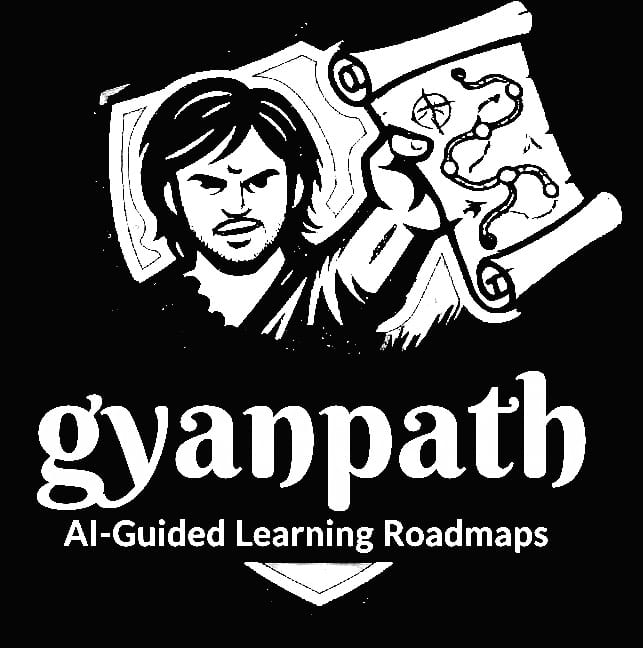
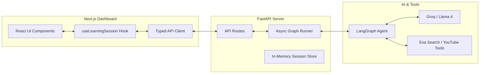
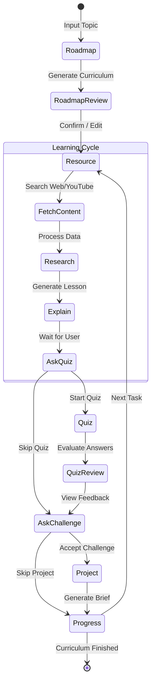

# 🎓 GyanPath — AI Learning Agent

[](https://github.com/anish170805/gyanpath)

**GyanPath** is a state-of-the-art AI-driven learning platform that bridges the gap between passive reading and active learning. Built on top of **LangGraph** and **FastAPI**, it orchestrates a sophisticated multi-step learning agent that creates personalized roadmaps, fetches real-world resources, conducts interactive quizzes, and challenges users with project briefs.

---

## 🏗 System Architecture

The following diagram illustrates the high-level communication between the interactive Next.js frontend and the LangGraph-powered backend.



---

## 🧠 Learning Pipeline (LangGraph)

GyanPath uses a cyclic directed graph to manage the learning state. The agent halts at specific **Interrupts** (Human-in-the-loop) to allow you to review the roadmap, answer quizzes, or accept challenges.



---

## 🚀 Key Features

- **Personalized Roadmaps**: AI generates a multi-step learning path for any topic.
- **Dynamic Content**: Fetches live articles and YouTube transcripts using **Exa Search**.
- **Human-in-the-Loop**: Seamlessly handles interrupts for roadmap editing and quiz submission.
- **Project-Based Learning**: Generates tailored project briefs to test your practical knowledge.
- **Modern UI**: A premium, dark-mode dashboard built with **Tailwind CSS** and **Next.js**.

---

## 🛠 Tech Stack

- **Frontend**: Next.js 15, React, Tailwind CSS, Lucide Icons, Framer Motion.
- **Backend API**: FastAPI, Uvicorn, Pydantic.
- **AI Orchestration**: LangGraph, LangChain.
- **LLM**: Groq (Llama-4-Scout).
- **Search Tools**: Exa.ai, YouTube Transcript API.

---

## ⚙️ Installation & Setup

### 1. Prerequisite API Keys
You will need API keys for the following services:
- **Groq API**: For high-speed LLM inference.
- **Exa API**: For web search and content retrieval.

### 2. Backend Setup
```bash
# Clone the repository
git clone https://github.com/anish170805/gyanpath
cd gyanpath

# Create and activate virtual environment
python -m venv venv
source venv/bin/activate  # Windows: venv\Scripts\activate

# Install dependencies
pip install -r requirements.txt

# Configure environment variables
# Create a .env file with:
# GROQ_API_KEY=your_key
# EXA_API_KEY=your_key

# Start the server
python -m uvicorn backend.main:app --host 0.0.0.0 --port 8000
```

### 3. Frontend Setup
```bash
cd frontend/gp_frontend

# Install dependencies
npm install

# Start the development server
npm run dev
```

Visit **`http://localhost:3000`** to start learning!

---

## 📁 Project Structure

```text
gyanpath/
├── backend/            # FastAPI Application
│   ├── routes/         # API Endpoint Handlers
│   ├── agent/          # Graph Execution Logic
│   └── models/         # Pydantic Schemas
├── frontend/           # Next.js Application
│   ├── components/     # UI Design System
│   └── hooks/          # Session State Management
├── graph.py            # LangGraph Definition
├── nodes.py            # Agent Logic per Node
└── states.py           # Shared State Models
```

---

## 📄 License

GyanPath is open-source. Feel free to fork and build your own learning agents!
