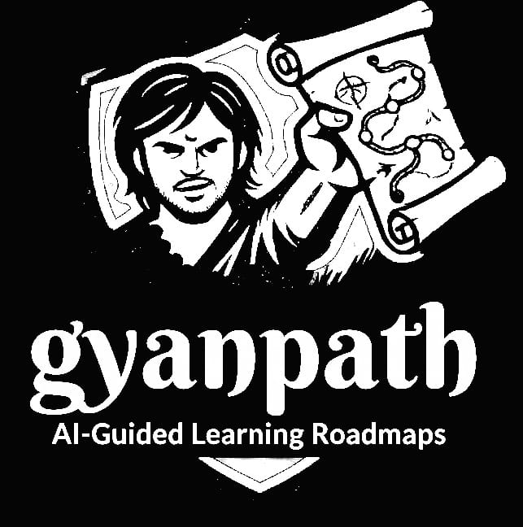
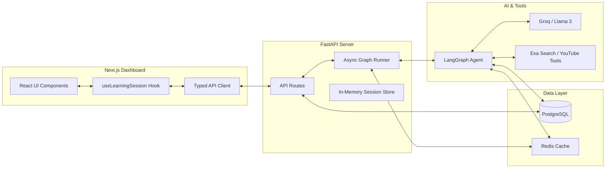
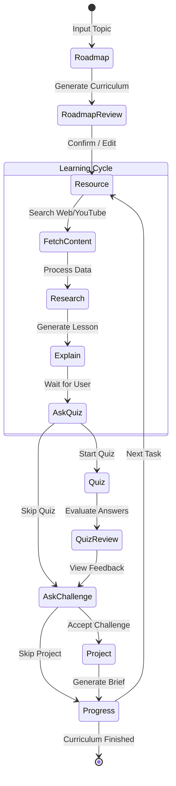
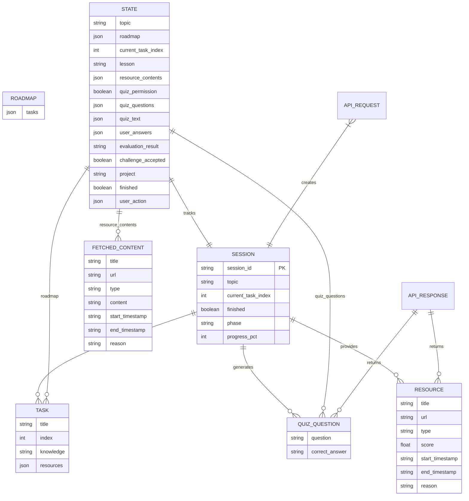
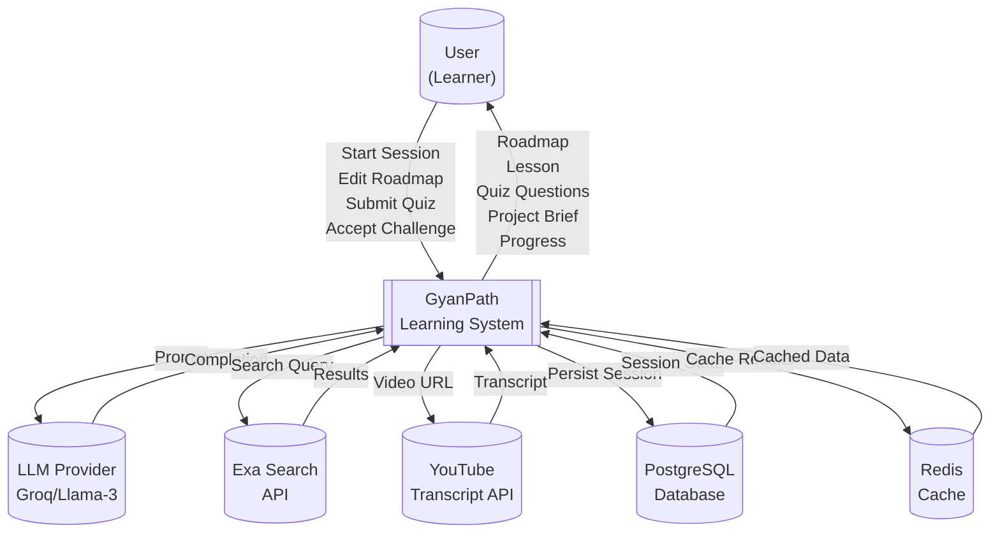
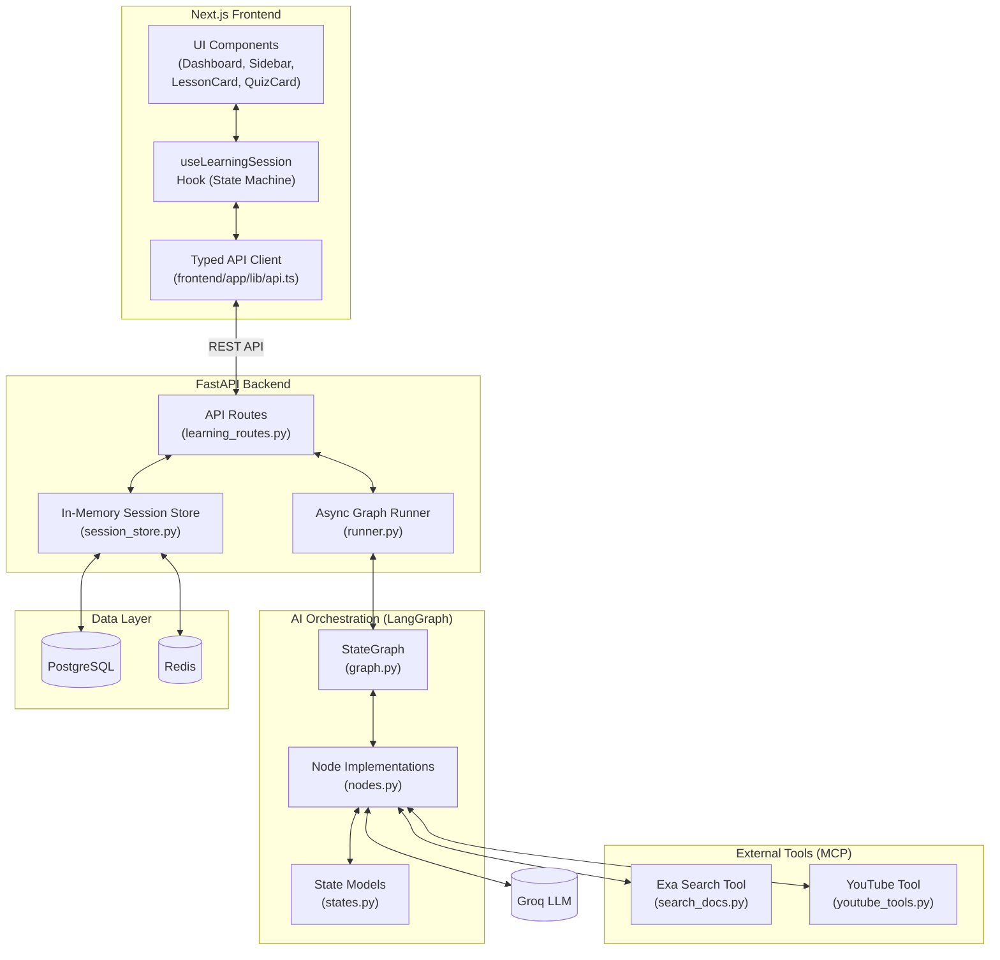
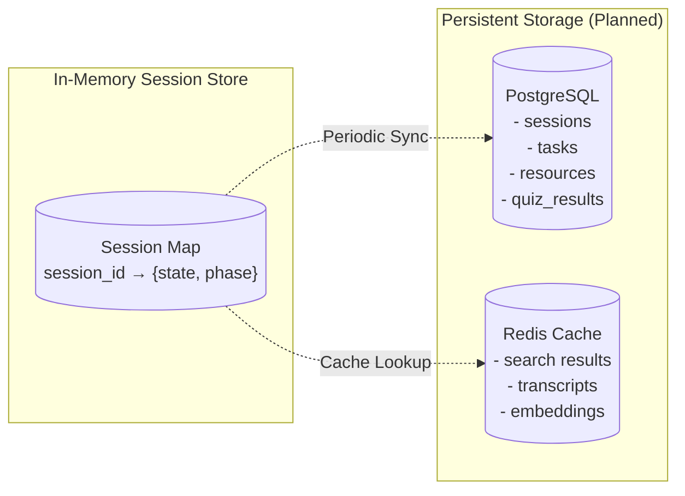

# 🎓 GyanPath — AI Learning Agent



**GyanPath** is a state-of-the-art AI-driven learning platform that bridges the gap between passive reading and active learning. Built on top of **LangGraph** and **FastAPI**, it orchestrates a sophisticated multi-step learning agent that creates personalized roadmaps, fetches real-world resources, conducts interactive quizzes, and challenges users with project briefs.

---

## 🏗 System Architecture

The following diagram illustrates the high-level communication between the interactive Next.js frontend and the LangGraph-powered backend.


```mermaid
graph LR
    subgraph Frontend [Next.js Dashboard]
        UI[React UI Components]
        Hook[useLearningSession Hook]
        API_Client[Typed API Client]
    end

    subgraph Backend [FastAPI Server]
        Routes[API Routes]
        Runner[Async Graph Runner]
        Store[In-Memory Session Store]
    end

    subgraph Intelligence [AI & Tools]
        LG[LangGraph Agent]
        LLM[Groq / Llama 3]
        Tools[Exa Search / YouTube Tools]
    end

    subgraph Data [Data Layer]
        DB[(PostgreSQL)]
        Cache[Redis Cache]
    end

    UI <--> Hook
    Hook <--> API_Client
    API_Client <--> Routes
    Routes <--> Runner
    Runner <--> LG
    LG <--> LLM
    LG <--> Tools
    LG <--> DB
    LG <--> Cache
    Routes <--> DB
    Runner <--> Cache
```

---

## 🧠 Learning Pipeline (LangGraph)

GyanPath uses a cyclic directed graph to manage the learning state. The agent halts at specific **Interrupts** (Human-in-the-loop) to allow you to review the roadmap, answer quizzes, or accept challenges.


```mermaid
stateDiagram-v2
    [*] --> Roadmap: Input Topic
    Roadmap --> RoadmapReview: Generate Curriculum
    RoadmapReview --> Resource: Confirm / Edit
    
    state "Learning Cycle" as Cycle {
        Resource --> FetchContent: Search Web/YouTube
        FetchContent --> Research: Process Data
        Research --> Explain: Generate Lesson
        Explain --> AskQuiz: Wait for User
    }

    AskQuiz --> Quiz: Start Quiz
    AskQuiz --> AskChallenge: Skip Quiz
    
    Quiz --> QuizReview: Evaluate Answers
    QuizReview --> AskChallenge: View Feedback
    
    AskChallenge --> Project: Accept Challenge
    AskChallenge --> Progress: Skip Project
    
    Project --> Progress: Generate Brief
    Progress --> Resource: Next Task
    Progress --> [*]: Curriculum Finished
```

---

## 🚀 Key Features

- **Personalized Roadmaps**: AI generates a multi-step learning path for any topic.
- **Dynamic Content**: Fetches live articles and YouTube transcripts using **Exa Search**.
- **Human-in-the-Loop**: Seamlessly handles interrupts for roadmap editing and quiz submission.
- **Project-Based Learning**: Generates tailored project briefs to test your practical knowledge.
- **Modern UI**: A premium, dark-mode dashboard built with **Tailwind CSS** and **Next.js**.

---

## 🛠 Tech Stack

- **Frontend**: Next.js 15, React, Tailwind CSS, Lucide Icons, Framer Motion.
- **Backend API**: FastAPI, Gunicorn, Uvicorn, Pydantic.
- **AI Orchestration**: LangGraph, LangChain.
- **LLM**: Groq (Llama-3.1-70B).
- **Search Tools**: Exa.ai, YouTube Transcript API.

---

## ⚙️ Installation & Setup

### 1. Prerequisite API Keys
You will need API keys for the following services:
- **Groq API**: For high-speed LLM inference.
- **Exa API**: For web search and content retrieval.

### 2. Backend Setup
```bash
# Clone the repository
git clone https://github.com/anish170805/gyanpath
cd gyanpath

# Create and activate virtual environment
python -m venv venv
source venv/bin/activate  # Windows: venv\Scripts\activate

# Install dependencies (from root)
pip install -r requirements.txt

# Configure environment variables
# Create a .env file in the root with:
# GROQ_API_KEY=your_key
# EXA_API_KEY=your_key

# Start the server
python -m uvicorn backend.main:app --host 0.0.0.0 --port 8000
```

### 3. Frontend Setup
```bash
cd frontend

# Install dependencies
npm install

# Start the development server
npm run dev
```

Visit **`http://localhost:3000`** to start learning!

---

## 🗄️ Entity-Relationship (ER) Diagram

The following diagram illustrates the core data entities and their relationships in the GyanPath learning system.


```mermaid
erDiagram
    SESSION ||--o{ TASK : contains
    SESSION ||--o{ QUIZ_QUESTION : generates
    SESSION ||--o{ RESOURCE : provides
    SESSION {
        string session_id PK
        string topic
        int current_task_index
        boolean finished
        string phase
        int progress_pct
    }
    
    TASK {
        string title
        int index
        string knowledge
        json resources
    }
    
    RESOURCE {
        string title
        string url
        string type
        float score
        string start_timestamp
        string end_timestamp
        string reason
    }
    
    QUIZ_QUESTION {
        string question
        string correct_answer
    }
    
    FETCHED_CONTENT {
        string title
        string url
        string type
        string content
        string start_timestamp
        string end_timestamp
        string reason
    }
    
    ROADMAP {
        json tasks
    }
    
    STATE ||--|| SESSION : tracks
    STATE ||--o{ TASK : roadmap
    STATE ||--o{ FETCHED_CONTENT : resource_contents
    STATE ||--o{ QUIZ_QUESTION : quiz_questions
    STATE {
        string topic
        json roadmap
        int current_task_index
        string lesson
        json resource_contents
        boolean quiz_permission
        json quiz_questions
        json quiz_text
        json user_answers
        string evaluation_result
        boolean challenge_accepted
        string project
        boolean finished
        json user_action
    }
    
    API_REQUEST }|--|| SESSION : creates
    API_RESPONSE ||--o{ RESOURCE : returns
    API_RESPONSE ||--o{ QUIZ_QUESTION : returns
```

---

## 📊 Data Flow Diagram (DFD)

### Level 0: Context Diagram


```mermaid
flowchart TD
    User[("User\n(Learner)")]
    System[["GyanPath\nLearning System"]]
    LLM[("LLM Provider\nGroq/Llama-3")]
    Exa[("Exa Search\nAPI")]
    YouTube[("YouTube\nTranscript API")]
    DB[("PostgreSQL\nDatabase")]
    Cache[("Redis\nCache")]

    User -->|Start Session\nEdit Roadmap\nSubmit Quiz\nAccept Challenge| System
    System -->|Roadmap\nLesson\nQuiz Questions\nProject Brief\nProgress| User
    System -->|Prompt| LLM
    LLM -->|Completion| System
    System -->|Search Query| Exa
    Exa -->|Results| System
    System -->|Video URL| YouTube
    YouTube -->|Transcript| System
    System -->|Persist Session| DB
    DB -->|Session State| System
    System -->|Cache Results| Cache
    Cache -->|Cached Data| System
```

### Level 1: System Decomposition


```mermaid
flowchart TD
    subgraph Frontend["Next.js Frontend"]
        UI["UI Components\n(Dashboard, Sidebar,\nLessonCard, QuizCard)"]
        Hook["useLearningSession\nHook (State Machine)"]
        API_Client["Typed API Client\n(frontend/app/lib/api.ts)"]
    end

    subgraph Backend["FastAPI Backend"]
        Routes["API Routes\n(learning_routes.py)"]
        Runner["Async Graph Runner\n(runner.py)"]
        Session_Store["In-Memory Session Store\n(session_store.py)"]
    end

    subgraph Intelligence["AI Orchestration (LangGraph)"]
        Graph["StateGraph\n(graph.py)"]
        Nodes["Node Implementations\n(nodes.py)"]
        State["State Models\n(states.py)"]
    end

    subgraph Tools["External Tools (MCP)"]
        Exa_Tool["Exa Search Tool\n(search_docs.py)"]
        YT_Tool["YouTube Tool\n(youtube_tools.py)"]
    end

    subgraph Data_Layer["Data Layer"]
        DB[("PostgreSQL")]
        Cache[("Redis")]
    end

    UI <--> Hook
    Hook <--> API_Client
    API_Client <-->|REST API| Routes
    Routes <--> Runner
    Runner <--> Graph
    Graph <--> Nodes
    Nodes <--> State
    Nodes <--> Exa_Tool
    Nodes <--> YT_Tool
    Nodes <--> LLM[("Groq LLM")]
    Routes <--> Session_Store
    Session_Store <--> DB
    Session_Store <--> Cache
```

### Level 2: Detailed Learning Flow Data Flow


```mermaid
flowchart TD
    %% Start Session Flow
    subgraph Start["1. Start Session"]
        S1["POST /start\n{topic}"]
        S2["Create State\n(topic, empty roadmap)"]
        S3["Run Graph\n→ roadmap_node"]
        S4["Interrupt: roadmap_review"]
        S5["Return Roadmap\nto Frontend"]
    end

    %% Roadmap Edit Flow
    subgraph Edit["2. Roadmap Editing (HITL)"]
        E1["POST /roadmap/edit\n{action, task, index}"]
        E2["Inject user_action\ninto State"]
        E3["Resume Graph\n→ review_node"]
        E4{Action == confirm?}
        E5["Return Updated\nRoadmap"]
        E6["Auto-confirm →\nresource → fetch →\nresearch → explain"]
        E7["Interrupt: quiz_permission"]
        E8["Return Lesson +\nResources"]
    end

    %% Quiz Flow
    subgraph Quiz["3. Quiz Flow"]
        Q1["User Clicks\n'Take Quiz'"]
        Q2["POST /quiz/start"]
        Q3["Inject quiz_permission=true"]
        Q4["Run quiz_node\n→ Generate Questions"]
        Q5["Interrupt: quiz_answer"]
        Q6["Return Questions\n(no answers)"]
        Q7["User Submits\nAnswers"]
        Q8["POST /quiz/submit\n{answers}"]
        Q9["Inject user_answers"]
        Q10["Run evaluate_quiz_node"]
        Q11["Interrupt: challenge_prompt"]
        Q12["Return Score +\nFeedback"]
    end

    %% Challenge Flow
    subgraph Challenge["4. Project Challenge"]
        C1["User Accepts/\nDeclines Challenge"]
        C2["POST /challenge\n{accepted}"]
        C3["Inject challenge_accepted"]
        C4{Accepted?}
        C5["Run project_node\n→ Generate Brief"]
        C6["Run progress_node"]
        C7{More Tasks?}
        C8["Loop to\nresource_node"]
        C9["Interrupt: quiz_permission\n(next lesson)"]
        C10["Return Project +\nNext Lesson Data"]
        C11["Finished\nReturn Complete"]
    end

    %% Next Lesson (Skip Quiz)
    subgraph Next["5. Next Lesson (Skip Quiz)"]
        N1["POST /next"]
        N2["Inject quiz_permission=false"]
        N3["Auto-decline\nchallenge"]
        N4["Run progress_node"]
        N5["Run resource →\nfetch → research → explain"]
        N6["Interrupt: quiz_permission"]
        N7["Return Next\nLesson Data"]
    end

    %% Connections
    S1 --> S2 --> S3 --> S4 --> S5
    S5 --> E1
    E1 --> E2 --> E3 --> E4
    E4 -->|No| E5
    E4 -->|Yes| E6 --> E7 --> E8
    E8 --> Q1
    Q1 --> Q2 --> Q3 --> Q4 --> Q5 --> Q6
    Q6 --> Q7 --> Q8 --> Q9 --> Q10 --> Q11 --> Q12
    Q12 --> C1
    C1 --> C2 --> C3 --> C4
    C4 -->|Yes| C5 --> C6
    C4 -->|No| C6
    C6 --> C7
    C7 -->|Yes| C8 --> N5 --> C9 --> C10
    C7 -->|No| C11
    E8 -.->|Skip Quiz| N1
    N1 --> N2 --> N3 --> N4 --> N5 --> N6 --> N7
```

### Data Stores


```mermaid
flowchart LR
    subgraph InMemory["In-Memory Session Store"]
        SM[("Session Map\nsession_id → {state, phase}")]
    end

    subgraph Persistent["Persistent Storage (Planned)"]
        PG[("PostgreSQL\n- sessions\n- tasks\n- resources\n- quiz_results")]
        RC[("Redis Cache\n- search results\n- transcripts\n- embeddings")]
    end

    SM -.->|Periodic Sync| PG
    SM -.->|Cache Lookup| RC
```

---

## 📁 Project Structure

```text
gyanpath/
├── backend/            # FastAPI Application & AI Logic
│   ├── agent/          # LangGraph (graph, nodes, states)
│   ├── routes/         # API Endpoint Handlers
│   ├── models/         # Pydantic Schemas
│   ├── MCP/            # External Tool Integrations
│   └── main.py         # FastAPI Entry Point
├── frontend/           # Next.js Application
│   ├── app/            # Application Router & Components
│   ├── public/         # Static Assets & Logo
│   └── lib/            # Typed API Client
├── Procfile            # Deployment Configuration (Render/Heroku)
└── requirements.txt    # Python Dependencies
```

---

## 📄 License

GyanPath is open-source. Feel free to fork and build your own learning agents!


---

## 📄 License

GyanPath is open-source. Feel free to fork and build your own learning agents!
